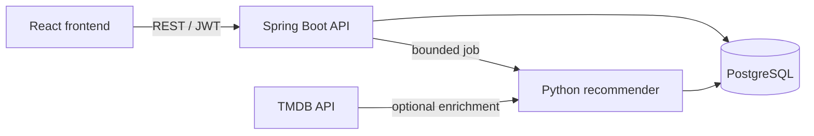

# Tonight's Pick

A full-stack movie recommendation platform built to explore the complete lifecycle of a recommender system: ingesting a
dataset, computing personalized results, serving them through an API, and turning them into a usable product.

The project combines a Spring Boot API, a React interface, a Python recommendation engine, and PostgreSQL. It is
designed as a portfolio project with an emphasis on explicit trade-offs and an understandable architecture.

## What the application does

- Creates an account and manages a personal profile.
- Captures movie, genre, and talent preferences.
- Searches and filters a paginated movie catalogue.
- Records ratings and exposes recent rating history.
- Produces personalized recommendations with a hybrid algorithm.
- Enriches MovieLens records with optional TMDB metadata.

## Architecture



The recommendation strategy blends a Bayesian popularity baseline with user-based collaborative filtering. The blend
changes with profile maturity so that a new user still receives useful results.

More detail is available in [the architecture](docs/architecture.md), [the recommendation design](docs/recommendation.md),
and [the catalogue data strategy](docs/catalog-data.md).

## Requirements

- Java 21
- Docker with Docker Compose
- Node.js 22 or newer
- GNU Make
- A TMDB API key only if poster and metadata enrichment is required

## Run locally

Clone the repository and create the local configuration:

```bash
git clone git@github.com:danielmassila/content-recommendation-platform.git
cd content-recommendation-platform
cp .env.example .env
```

Prepare PostgreSQL and the MovieLens demonstration dataset:

```bash
make demo-data
```

Then start the two application processes in separate terminals:

```bash
make api
```

```bash
make frontend
```

Open:

- Frontend: http://localhost:5173
- API: http://localhost:8081
- Adminer: http://localhost:8082

The first dataset preparation downloads MovieLens and can take a few minutes. TMDB enrichment is optional:

```bash
# Set TMDB_API_KEY in .env first
make py-enrich-tmdb
```

## Tests

```bash
make test-frontend
make test-backend
make test-python-docker
```

The backend test suite requires Docker for its PostgreSQL integration test.

## Repository structure

```text
backend/    Spring Boot REST API, Flyway migrations, and Java tests
frontend/   React/Vite application and component tests
reco-ml/    Recommendation algorithms, data jobs, and Python tests
docs/       Architecture decisions, data strategy, and performance notes
```

## Current scope

This is a local demonstration architecture, not a production deployment template. Runtime hardening, authorization
roles, CI/CD, cache infrastructure, and observability are intentionally left as explicit future engineering work rather
than presented as finished features.

## Development approach

This project is AI-assisted. AI was used as a development accelerator for implementation and review; architectural
choices, scope decisions, validation, and final ownership remain part of the project work. The commit history and
documentation are kept to make those decisions inspectable.
